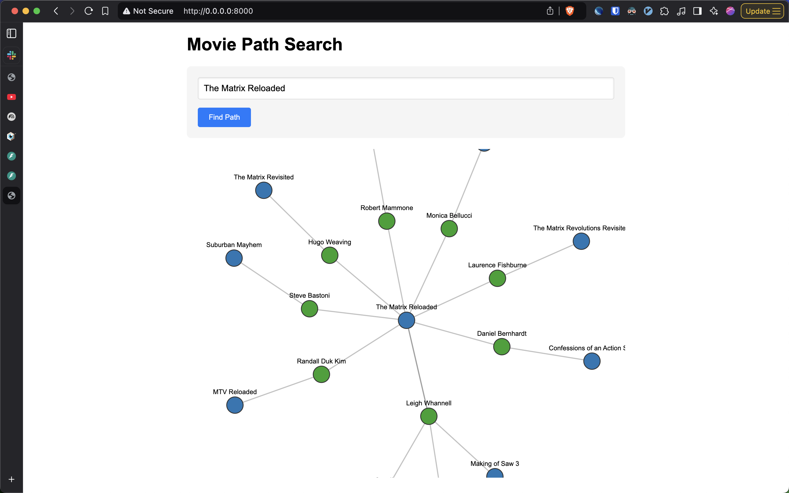

# What is this?

`movie-chain` is a webapp that shows a graph of movies originating from a single movie and moving away by edges of actors that are in each movie.

Starting from a single movie, a graph is made going from the starting movie to a set of movies that have some actor from the first movie. Then each of those movies is connected to another set of movies by some other actor. And so on. The hard limit of path size is 3 so 1 starting movie going out to a bunch of related movies connected by some set of actors from the starting movie.

# How to run

1. run `docker compose up --build --detach` to start the neo4j db and the fastapi server
2. load the csvs in the neo4j db (TODO: how)
3. check the logs of the fastapi container to see the local address where the server is running (should be http://0.0.0.0:8000)
4. enter a movie title and press `Find Path` to see
